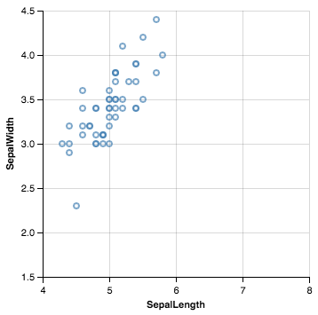
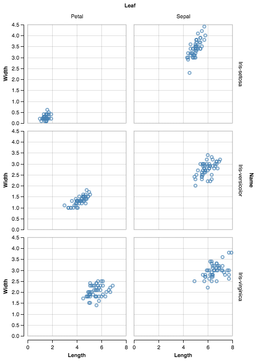

>**Note:**
>This Readme has been automatically created by [zepppelin2md.py](https://github.com/bernhard-42/zeppelin2md).

>Alternatively, load into your Zeppelin instance using the URL 
>    `https://raw.githubusercontent.com/bernhard-42/zeppelin-ipython-shim/master/examples/VegaLite%20-%20Overview.json`

# examples/VegaLite - Overview.json

---

**Homepage:** https://vega.github.io/vega-lite/


---


_Input:_

```python
%pyspark
import sys
print("Python: " + sys.version.replace("\n", " - "))
print("Spark:  " + sc.version)
```


_Result:_

```
Python: 3.5.2 |Anaconda 4.3.0 (x86_64)| (default, Jul  2 2016, 17:52:12)  - [GCC 4.2.1 Compatible Apple LLVM 4.2 (clang-425.0.28)]
Spark:  2.1.0

```

---

## 1 Initialize ZeppelinCommLayer


---

#### Import the Zeppelin Comm Layer, intialize it ...

_Input:_

```python
%pyspark

from zeppelin_comm_layer import ZeppelinCommLayer
zcl = ZeppelinCommLayer(z.z, logLevel="DEBUG")
```


---

#### ... and start it in the next (!) Zeppelin paragraph

_Input:_

```python
%pyspark
zcl.start()
```


---

## 2 Using Vega Lite


---


_Input:_

```python
%pyspark
vg = zcl.enableVegaLite()
```


_Result:_

```
        <script src="http://d3js.org/d3.v3.min.js" charset="utf-8"></script>
        <script src="http://vega.github.io/vega/vega.js" charset="utf-8"></script>
        <script src="http://vega.github.io/vega-lite/vega-lite.js" charset="utf-8"></script>
        <div>Execute <vg>.output_notebook() in the next paragraph (<vg> references the VegaLite instance)</div>
        

```

---


_Input:_

```python
%pyspark
vg.output_notebook()
```


_Result:_

```
        <script src="http://vega.github.io/vega-editor/vendor/vega-embed.js" charset="utf-8"></script>
        <div>Vega-Lite is ready to be used</div>
        

```

---

#### A first plot

_Input:_

```python
%pyspark
#!zeppelin2md:barchart.png

data = [
  {"a": "A","b": 28}, {"a": "B","b": 55}, {"a": "C","b": 43},
  {"a": "D","b": 91}, {"a": "E","b": 81}, {"a": "F","b": 53},
  {"a": "G","b": 19}, {"a": "H","b": 87}, {"a": "I","b": 52}
]
    
barChart = {
  "description": "A simple bar chart with embedded data.",
  "data": {"values": data},
  "mark": "bar",
  "encoding": {
    "x": {"field": "a", "type": "ordinal"},
    "y": {"field": "b", "type": "quantitative"}
  }
}

vg.plot("b1", barChart, title="Histogramm")
```


_Result:_


---

## Visualizing iris data


---


_Input:_

```bash
%sh
cd /tmp
wget  https://raw.github.com/pydata/pandas/master/pandas/tests/data/iris.csv
```


_Result:_

```
--2017-03-05 19:45:01--  https://raw.github.com/pydata/pandas/master/pandas/tests/data/iris.csv
Resolving raw.github.com... 151.101.112.133
Connecting to raw.github.com|151.101.112.133|:443... connected.
HTTP request sent, awaiting response... 301 Moved Permanently
Location: https://raw.githubusercontent.com/pydata/pandas/master/pandas/tests/data/iris.csv [following]
--2017-03-05 19:45:02--  https://raw.githubusercontent.com/pydata/pandas/master/pandas/tests/data/iris.csv
Resolving raw.githubusercontent.com... 151.101.112.133
Connecting to raw.githubusercontent.com|151.101.112.133|:443... connected.
HTTP request sent, awaiting response... 200 OK
Length: 4600 (4.5K) [text/plain]
Saving to: ‘iris.csv.1’

     0K ....                                                  100% 29.4M=0s

2017-03-05 19:45:02 (29.4 MB/s) - ‘iris.csv.1’ saved [4600/4600]


```

---


_Input:_

```python
%pyspark
import pandas as pd
iris = pd.read_csv('/tmp/iris.csv')
print(iris.head())
```


_Result:_

```
   SepalLength  SepalWidth  PetalLength  PetalWidth         Name
0          5.1         3.5          1.4         0.2  Iris-setosa
1          4.9         3.0          1.4         0.2  Iris-setosa
2          4.7         3.2          1.3         0.2  Iris-setosa
3          4.6         3.1          1.5         0.2  Iris-setosa
4          5.0         3.6          1.4         0.2  Iris-setosa

```

---

#### Prepare the scatter plot ...

_Input:_

```python
%pyspark
#!zeppelin2md:iris-scatter.gif

columns = ['SepalLength', 'SepalWidth', 'PetalLength', 'PetalWidth']
species = ['Iris-setosa', 'Iris-versicolor', 'Iris-virginica']

def irisScatterSpec(name, col1, col2, height=200, width=200):
    data = vg.dfToJson(iris[iris["Name"] == name], [col1, col2])
    vlSpec = {
        "width": width,
        "height": height,
        "data": {"values":data},
        "mark": "point",
        "encoding": {
            "x": {"field": col1, "type": "quantitative", "scale": {"domain":[4.0,8.0]}},
            "y": {"field": col2, "type": "quantitative", "scale": {"domain":[1.5,4.5]}}
        }
    }
    return vlSpec

vg.prepare("iris-scatter")
```


_Result:_



---

#### ... and iterate over the species

_Input:_

```python
%pyspark

import time

for s in species:
    vlSpec = irisScatterSpec(s, "SepalLength", "SepalWidth", 300, 300)
    vg.update("iris-scatter", vlSpec, title=s, delay=0, height=300)
    time.sleep(3)
```


---

### Quickly build a Trellis Plot


---


_Input:_

```python
%pyspark

iris_s = iris.loc[:,["SepalLength", "SepalWidth", "Name"]]
iris_s.columns = ["Length", "Width", "Name"]
iris_s["Leaf"] = "Sepal"

iris_p = iris.loc[:,["PetalLength", "PetalWidth", "Name"]]
iris_p.columns = ["Length", "Width", "Name"]
iris_p["Leaf"] = "Petal"

iris2 = pd.concat([iris_s, iris_p])
iris2.head()
```


_Result:_

```
   Length  Width         Name   Leaf
0     5.1    3.5  Iris-setosa  Sepal
1     4.9    3.0  Iris-setosa  Sepal
2     4.7    3.2  Iris-setosa  Sepal
3     4.6    3.1  Iris-setosa  Sepal
4     5.0    3.6  Iris-setosa  Sepal

```

---


_Input:_

```python
%pyspark
#!zeppelin2md:iris-trellis.png

vlSpec = {
  "description": "Iris Data",
  "data": {"values": vg.dfToJson(iris2, iris2.columns)},
  "mark": "point",
  "encoding": {
    "row": {"field": "Name", "type": "ordinal"},
    "column":    {"field": "Leaf", "type": "ordinal"},
    "x": {"field": "Length", "type": "quantitative"},
    "y": {"field": "Width",  "type": "quantitative"}
  }
}
vg.plot("iris-trellis", vlSpec, title="Iris Overview")
```


_Result:_



---


_Input:_

```python
%pyspark
```

