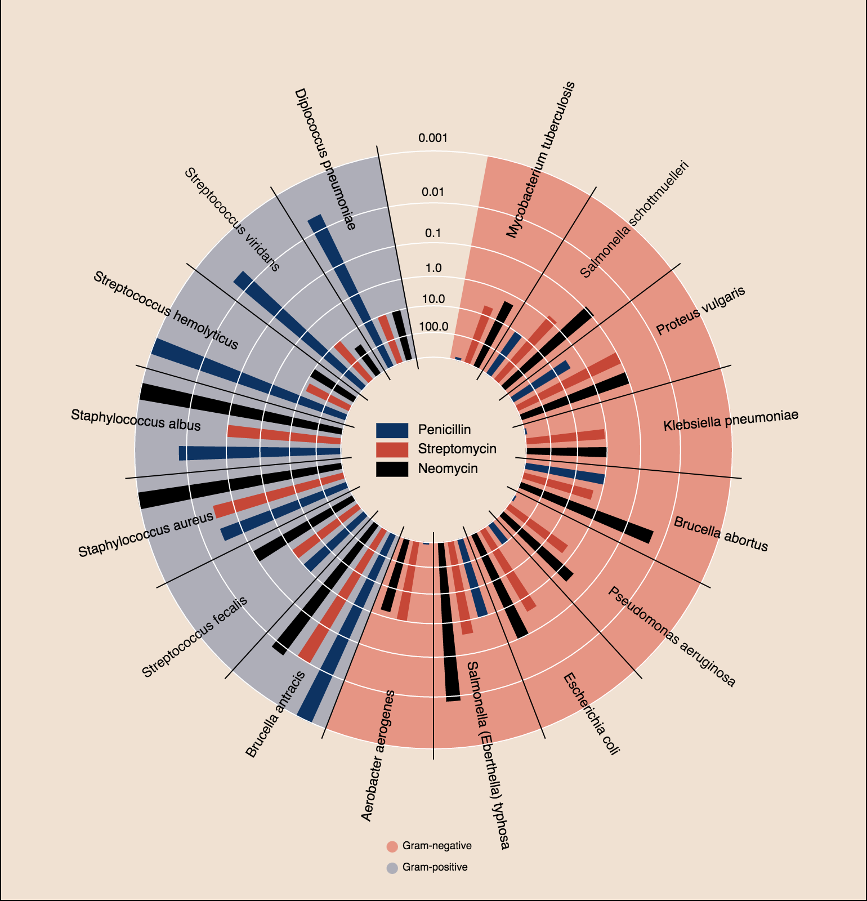

>**Note:**
>This Readme has been automatically created by [zepppelin2md.py](https://github.com/bernhard-42/zeppelin2md).

>Alternatively, load into your Zeppelin instance using the URL 
>    `https://raw.githubusercontent.com/bernhard-42/zeppelin-ipython-shim/master/notebooks/ZeppelinCommLayer%20Bokeh%20Gallery.json`

# notebooks/ZeppelinCommLayer Bokeh Gallery.json

---


_Input:_

```python
%pyspark

def versionCheck():
    import sys
    print("Python: " + sys.version.replace("\n", " - "))
    print("Spark:  " + sc.version)

def display(html):
    print("%angular")
    print(html)

def getNoteId():
    return z.z.getInterpreterContext().getNoteId()

def getParagraphId():
    return z.z.getInterpreterContext().getParagraphId()


versionCheck()
```


_Result:_

```
Python: 3.5.2 |Anaconda 4.3.0 (x86_64)| (default, Jul  2 2016, 17:52:12)  - [GCC 4.2.1 Compatible Apple LLVM 4.2 (clang-425.0.28)]
Spark:  2.1.0

```

---

#### Import the Zeppelin Comm Layer, intialize it ...

_Input:_

```python
%pyspark

from zeppelin_comm_layer import ZeppelinCommLayer, resetZeppelinCommLayer, LogLevel

# resetZeppelinCommLayer(z.z)
LogLevel().setLogLevel("DEBUG")

zcl = ZeppelinCommLayer(z.z)
```


---

#### ... and start it in the next Zeppelin paragraph(!) 

_Input:_

```python
%pyspark

zcl.start()
```


---

#### Adapt Bokeh global state management to Zeppelin

_Input:_

```python
%pyspark

zcl.enableBokeh()
```


---

#### Import Bokeh and redirect output to Zeppelin

_Input:_

```python
%pyspark
from bokeh.io import push_notebook, show, output_notebook
from bokeh.layouts import row
from bokeh.resources import Resources
from bokeh.plotting import figure

output_notebook()
```


---


_Input:_

```python
%pyspark
#!zeppelin2md:images/bokeh-gallery-1.png

from bokeh.charts import Bar, output_file, show
from bokeh.charts.attributes import cat, color
from bokeh.charts.operations import blend
from bokeh.charts.utils import df_from_json
from bokeh.sampledata.olympics2014 import data

# utilize utility to make it easy to get json/dict data converted to a dataframe
df = df_from_json(data)

# filter by countries with at least one medal and sort by total medals
df = df[df['total'] > 0]
df = df.sort("total", ascending=False)

bar = Bar(df,
          values=blend('bronze', 'silver', 'gold', name='medals', labels_name='medal'),
          label=cat(columns='abbr', sort=False),
          stack=cat(columns='medal', sort=False),
          color=color(columns='medal', palette=['SaddleBrown', 'Silver', 'Goldenrod'],
                      sort=False),
          legend='top_right',
          title="Medals per Country, Sorted by Total Medals",
          tooltips=[('medal', '@medal'), ('country', '@abbr')])


show(bar)
```


_Result:_


---


_Input:_

```python
%pyspark
#!zeppelin2md:images/bokeh-gallery-2.png

from __future__ import print_function

from bokeh.document import Document
from bokeh.embed import file_html
from bokeh.layouts import gridplot
from bokeh.models.glyphs import Circle
from bokeh.models import (BasicTicker, ColumnDataSource, Grid, LinearAxis,
                         DataRange1d, PanTool, Plot, WheelZoomTool)
from bokeh.resources import INLINE
from bokeh.sampledata.iris import flowers
from bokeh.util.browser import view

colormap = {'setosa': 'red', 'versicolor': 'green', 'virginica': 'blue'}

flowers['color'] = flowers['species'].map(lambda x: colormap[x])


source = ColumnDataSource(
    data=dict(
        petal_length=flowers['petal_length'],
        petal_width=flowers['petal_width'],
        sepal_length=flowers['sepal_length'],
        sepal_width=flowers['sepal_width'],
        color=flowers['color']
    )
)

xdr = DataRange1d(bounds=None)
ydr = DataRange1d(bounds=None)

def make_plot(xname, yname, xax=False, yax=False):
    mbl = 40 if yax else 0
    mbb = 40 if xax else 0
    plot = Plot(
        x_range=xdr, y_range=ydr, background_fill_color="#efe8e2",
        border_fill_color='white', plot_width=200 + mbl, plot_height=200 + mbb,
        min_border_left=2+mbl, min_border_right=2, min_border_top=2, min_border_bottom=2+mbb)

    circle = Circle(x=xname, y=yname, fill_color="color", fill_alpha=0.2, size=4, line_color="color")
    r = plot.add_glyph(source, circle)

    xdr.renderers.append(r)
    ydr.renderers.append(r)

    xticker = BasicTicker()
    if xax:
        xaxis = LinearAxis()
        plot.add_layout(xaxis, 'below')
        xticker = xaxis.ticker
    plot.add_layout(Grid(dimension=0, ticker=xticker))

    yticker = BasicTicker()
    if yax:
        yaxis = LinearAxis()
        plot.add_layout(yaxis, 'left')
        yticker = yaxis.ticker
    plot.add_layout(Grid(dimension=1, ticker=yticker))

    plot.add_tools(PanTool(), WheelZoomTool())

    return plot

xattrs = ["petal_length", "petal_width", "sepal_width", "sepal_length"]
yattrs = list(reversed(xattrs))
plots = []

for y in yattrs:
    row = []
    for x in xattrs:
        xax = (y == yattrs[-1])
        yax = (x == xattrs[0])
        plot = make_plot(x, y, xax, yax)
        row.append(plot)
    plots.append(row)

grid = gridplot(plots)

show(grid)
```


_Result:_


---


_Input:_

```python
%pyspark
#!zeppelin2md:images/bokeh-gallery-3.png

import numpy as np
from scipy.integrate import odeint

from bokeh.plotting import figure, show

ZBAK = z # Zeppelin bug

sigma = 10
rho = 28
beta = 8.0/3
theta = 3 * np.pi / 4

def lorenz(xyz, t):
    x, y, z = xyz
    x_dot = sigma * (y - x)
    y_dot = x * rho - x * z - y
    z_dot = x * y - beta* z
    return [x_dot, y_dot, z_dot]

initial = (-10, -7, 35)
t = np.arange(0, 100, 0.006)

solution = odeint(lorenz, initial, t)

x = solution[:, 0]
y = solution[:, 1]
z = solution[:, 2]
xprime = np.cos(theta) * x - np.sin(theta) * y

colors = ["#C6DBEF", "#9ECAE1", "#6BAED6", "#4292C6", "#2171B5", "#08519C", "#08306B",]

p = figure(title="lorenz example")

p.multi_line(np.array_split(xprime, 7), np.array_split(z, 7),
             line_color=colors, line_alpha=0.8, line_width=1.5)


show(p)  # open a browser

z = ZBAK # Zeppelin bug
```


_Result:_


---


_Input:_

```python
%pyspark
#!zeppelin2md:images/bokeh-gallery-4.png

from bokeh.models import HoverTool, ColumnDataSource
from bokeh.plotting import figure, show, save
from bokeh.sampledata.periodic_table import elements

romans = ["I", "II", "III", "IV", "V", "VI", "VII"]

elements = elements.copy()
elements["atomic mass"] = elements["atomic mass"].astype(str)

elements["period"] = [romans[x-1] for x in elements.period]
elements = elements[elements.group != "-"]

group_range = [str(x) for x in range(1, 19)]

colormap = {
    "alkali metal"         : "#a6cee3",
    "alkaline earth metal" : "#1f78b4",
    "halogen"              : "#fdbf6f",
    "metal"                : "#b2df8a",
    "metalloid"            : "#33a02c",
    "noble gas"            : "#bbbb88",
    "nonmetal"             : "#baa2a6",
    "transition metal"     : "#e08e79",
}

source = ColumnDataSource(
    data=dict(
        group=[str(x) for x in elements["group"]],
        period=[str(y) for y in elements["period"]],
        symx=[str(x)+":0.1" for x in elements["group"]],
        numbery=[str(x)+":0.8" for x in elements["period"]],
        massy=[str(x)+":0.15" for x in elements["period"]],
        namey=[str(x)+":0.3" for x in elements["period"]],
        sym=elements["symbol"],
        name=elements["name"],
        cpk=elements["CPK"],
        atomic_number=elements["atomic number"],
        electronic=elements["electronic configuration"],
        mass=elements["atomic mass"],
        type=elements["metal"],
        type_color=[colormap[x] for x in elements["metal"]],
    )
)

p = figure(title="Periodic Table", tools="hover,save",
           x_range=group_range, y_range=list(reversed(romans)))
p.plot_width = 1200
p.toolbar_location = None
p.outline_line_color = None

p.rect("group", "period", 0.9, 0.9, source=source,
       fill_alpha=0.6, color="type_color")

text_props = {
    "source": source,
    "angle": 0,
    "color": "black",
    "text_align": "left",
    "text_baseline": "middle"
}

p.text(x="symx", y="period", text="sym",
       text_font_style="bold", text_font_size="15pt", **text_props)

p.text(x="symx", y="numbery", text="atomic_number",
       text_font_size="9pt", **text_props)

p.text(x="symx", y="namey", text="name",
       text_font_size="6pt", **text_props)

p.text(x="symx", y="massy", text="mass",
       text_font_size="5pt", **text_props)

p.grid.grid_line_color = None

p.select_one(HoverTool).tooltips = [
    ("name", "@name"),
    ("atomic number", "@atomic_number"),
    ("type", "@type"),
    ("atomic mass", "@mass"),
    ("CPK color", "$color[hex, swatch]:cpk"),
    ("electronic configuration", "@electronic"),
]


show(p)  # Change to save(p) to save but not show the HTML file#
```


_Result:_


---


_Input:_

```python
%pyspark
#!zeppelin2md:images/bokeh-gallery-5.png

from collections import OrderedDict
from math import log, sqrt

import numpy as np
import pandas as pd
from six.moves import cStringIO as StringIO

from bokeh.plotting import figure, show, output_file

antibiotics = """
bacteria,                        penicillin, streptomycin, neomycin, gram
Mycobacterium tuberculosis,      800,        5,            2,        negative
Salmonella schottmuelleri,       10,         0.8,          0.09,     negative
Proteus vulgaris,                3,          0.1,          0.1,      negative
Klebsiella pneumoniae,           850,        1.2,          1,        negative
Brucella abortus,                1,          2,            0.02,     negative
Pseudomonas aeruginosa,          850,        2,            0.4,      negative
Escherichia coli,                100,        0.4,          0.1,      negative
Salmonella (Eberthella) typhosa, 1,          0.4,          0.008,    negative
Aerobacter aerogenes,            870,        1,            1.6,      negative
Brucella antracis,               0.001,      0.01,         0.007,    positive
Streptococcus fecalis,           1,          1,            0.1,      positive
Staphylococcus aureus,           0.03,       0.03,         0.001,    positive
Staphylococcus albus,            0.007,      0.1,          0.001,    positive
Streptococcus hemolyticus,       0.001,      14,           10,       positive
Streptococcus viridans,          0.005,      10,           40,       positive
Diplococcus pneumoniae,          0.005,      11,           10,       positive
"""

drug_color = OrderedDict([
    ("Penicillin",   "#0d3362"),
    ("Streptomycin", "#c64737"),
    ("Neomycin",     "black"  ),
])

gram_color = {
    "positive" : "#aeaeb8",
    "negative" : "#e69584",
}

df = pd.read_csv(StringIO(antibiotics),
                 skiprows=1,
                 skipinitialspace=True,
                 engine='python')

width = 800
height = 800
inner_radius = 90
outer_radius = 300 - 10

minr = sqrt(log(.001 * 1E4))
maxr = sqrt(log(1000 * 1E4))
a = (outer_radius - inner_radius) / (minr - maxr)
b = inner_radius - a * maxr

def rad(mic):
    return a * np.sqrt(np.log(mic * 1E4)) + b

big_angle = 2.0 * np.pi / (len(df) + 1)
small_angle = big_angle / 7

p = figure(plot_width=width, plot_height=height, title="",
    x_axis_type=None, y_axis_type=None,
    x_range=(-420, 420), y_range=(-420, 420),
    min_border=0, outline_line_color="black",
    background_fill_color="#f0e1d2", border_fill_color="#f0e1d2",
    toolbar_sticky=False)

p.xgrid.grid_line_color = None
p.ygrid.grid_line_color = None

# annular wedges
angles = np.pi/2 - big_angle/2 - df.index.to_series()*big_angle
colors = [gram_color[gram] for gram in df.gram]
p.annular_wedge(
    0, 0, inner_radius, outer_radius, -big_angle+angles, angles, color=colors,
)

# small wedges
p.annular_wedge(0, 0, inner_radius, rad(df.penicillin),
                -big_angle+angles+5*small_angle, -big_angle+angles+6*small_angle,
                color=drug_color['Penicillin'])
p.annular_wedge(0, 0, inner_radius, rad(df.streptomycin),
                -big_angle+angles+3*small_angle, -big_angle+angles+4*small_angle,
                color=drug_color['Streptomycin'])
p.annular_wedge(0, 0, inner_radius, rad(df.neomycin),
                -big_angle+angles+1*small_angle, -big_angle+angles+2*small_angle,
                color=drug_color['Neomycin'])

# circular axes and lables
labels = np.power(10.0, np.arange(-3, 4))
radii = a * np.sqrt(np.log(labels * 1E4)) + b
p.circle(0, 0, radius=radii, fill_color=None, line_color="white")
p.text(0, radii[:-1], [str(r) for r in labels[:-1]],
       text_font_size="8pt", text_align="center", text_baseline="middle")

# radial axes
p.annular_wedge(0, 0, inner_radius-10, outer_radius+10,
                -big_angle+angles, -big_angle+angles, color="black")

# bacteria labels
xr = radii[0]*np.cos(np.array(-big_angle/2 + angles))
yr = radii[0]*np.sin(np.array(-big_angle/2 + angles))
label_angle=np.array(-big_angle/2+angles)
label_angle[label_angle < -np.pi/2] += np.pi # easier to read labels on the left side
p.text(xr, yr, df.bacteria, angle=label_angle,
       text_font_size="9pt", text_align="center", text_baseline="middle")

# OK, these hand drawn legends are pretty clunky, will be improved in future release
p.circle([-40, -40], [-370, -390], color=list(gram_color.values()), radius=5)
p.text([-30, -30], [-370, -390], text=["Gram-" + gr for gr in gram_color.keys()],
       text_font_size="7pt", text_align="left", text_baseline="middle")

p.rect([-40, -40, -40], [18, 0, -18], width=30, height=13,
       color=list(drug_color.values()))
p.text([-15, -15, -15], [18, 0, -18], text=list(drug_color),
       text_font_size="9pt", text_align="left", text_baseline="middle")


show(p)
```


_Result:_



---


_Input:_

```python
%pyspark
#!zeppelin2md:images/bokeh-gallery-6.png

from bokeh.io import show
from bokeh.models import (
    ColumnDataSource,
    HoverTool,
    LogColorMapper
)
from bokeh.palettes import Viridis6 as palette
from bokeh.plotting import figure

from bokeh.sampledata.us_counties import data as counties
from bokeh.sampledata.unemployment import data as unemployment

palette.reverse()

counties = {
    code: county for code, county in counties.items() if county["state"] == "tx"
}

county_xs = [county["lons"] for county in counties.values()]
county_ys = [county["lats"] for county in counties.values()]

county_names = [county['name'] for county in counties.values()]
county_rates = [unemployment[county_id] for county_id in counties]
color_mapper = LogColorMapper(palette=palette)

source = ColumnDataSource(data=dict(
    x=county_xs,
    y=county_ys,
    name=county_names,
    rate=county_rates,
))

TOOLS = "pan,wheel_zoom,box_zoom,reset,hover,save"

p = figure(
    title="Texas Unemployment, 2009", tools=TOOLS,
    x_axis_location=None, y_axis_location=None
)
p.grid.grid_line_color = None

p.patches('x', 'y', source=source,
          fill_color={'field': 'rate', 'transform': color_mapper},
          fill_alpha=0.7, line_color="white", line_width=0.5)

hover = p.select_one(HoverTool)
hover.point_policy = "follow_mouse"
hover.tooltips = [
    ("Name", "@name"),
    ("Unemployment rate)", "@rate%"),
    ("(Long, Lat)", "($x, $y)"),
]

show(p)
```


_Result:_


---


_Input:_

```python
%pyspark
#!zeppelin2md:images/bokeh-gallery-7.png

import pandas as pd
from bokeh.charts import output_file, Chord
from bokeh.io import show
from bokeh.sampledata.les_mis import data

nodes = data['nodes']
links = data['links']

nodes_df = pd.DataFrame(nodes)
links_df = pd.DataFrame(links)

source_data = links_df.merge(nodes_df, how='left', left_on='source', right_index=True)
source_data = source_data.merge(nodes_df, how='left', left_on='target', right_index=True)
source_data = source_data[source_data["value"] > 5]

chord_from_df = Chord(source_data, source="name_x", target="name_y", value="value")

show(chord_from_df)
```


_Result:_


---


_Input:_

```python
%pyspark
```

