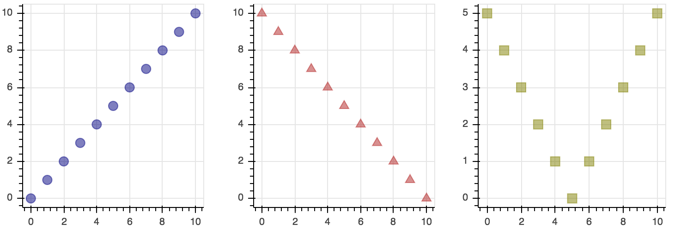
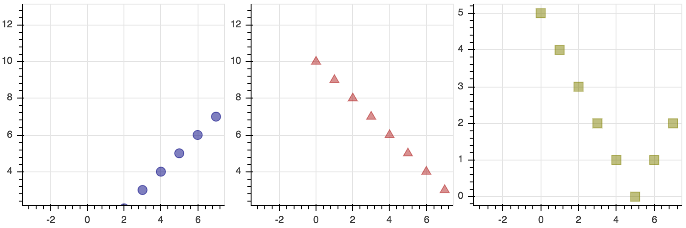
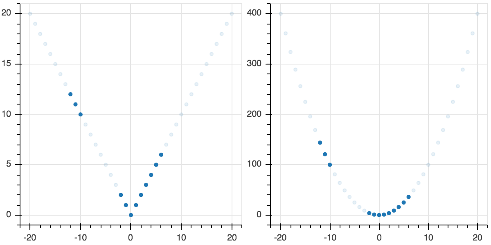
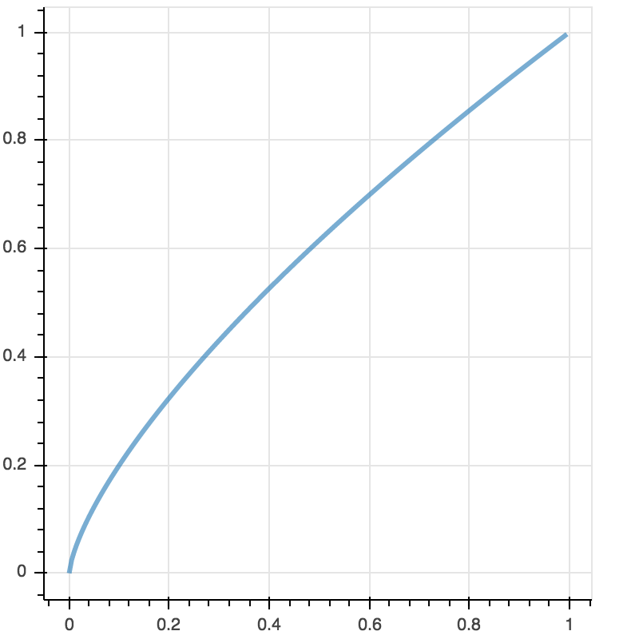

>**Note:**
>This Readme has been automatically created by [zepppelin2md.py](https://github.com/bernhard-42/zeppelin2md).

>Alternatively, load into your Zeppelin instance using the URL 
>    `https://raw.githubusercontent.com/bernhard-42/zeppelin-ipython-shim/master/notebooks/ZeppelinCommLayer%20Overview.json`

# notebooks/ZeppelinCommLayer Overview.json

---


_Input:_

```python
%pyspark

def versionCheck():
    import sys
    print("Python: " + sys.version.replace("\n", " - "))
    print("Spark:  " + sc.version)

def display(html):
    print("%angular")
    print(html)

def getNoteId():
    return z.z.getInterpreterContext().getNoteId()

def getParagraphId():
    return z.z.getInterpreterContext().getParagraphId()


versionCheck()
```


_Result:_

```
Python: 3.5.2 |Anaconda 4.3.0 (x86_64)| (default, Jul  2 2016, 17:52:12)  - [GCC 4.2.1 Compatible Apple LLVM 4.2 (clang-425.0.28)]
Spark:  2.1.0

```

---

## 1 Initialize ZeppelinCommLayer


---

#### Import the Zeppelin Comm Layer, intialize it ...

_Input:_

```python
%pyspark

from zeppelin_comm_layer import ZeppelinCommLayer, resetZeppelinCommLayer, LogLevel

# resetZeppelinCommLayer(z.z)
LogLevel().setLogLevel("DEBUG")

zcl = ZeppelinCommLayer(z.z)
```


---

#### ... and start it in the next (!) Zeppelin paragraph

_Input:_

```python
%pyspark

zcl.start()
```


---

## 2 Use Bokeh

**Note:** Without patching the global state of Bokeh for Zeppelin, push_notebook will only work when only one session with Bokeh is running on one Zeppelin session


---

#### Load Bokeh libraries and redirect output to Zeppelin Notebook

_Input:_

```python
%pyspark
from bokeh.io import push_notebook, show, output_notebook
from bokeh.layouts import row
from bokeh.resources import Resources
from bokeh.plotting import figure

output_notebook()
```


---

####  Render a first plot

_Input:_

```python
%pyspark
#!zeppelin2md:images/bokeh-overview-1.gif

opts = dict(plot_width=250, plot_height=250, min_border=0)
p1 = figure(**opts)
r1 = p1.circle([1,2,3], [4,5,6], size=20)

p2 = figure(**opts)
r2 = p2.circle([1,2,3], [4,5,6], size=20)

handle1 = show(row(p1, p2), notebook_handle=True)
```


_Result:_


---

#### And modify it via push_notebook

_Input:_

```python
%pyspark

r1.glyph.fill_color = "yellow"
r2.glyph.fill_color = "orange"

push_notebook(handle=handle1)
```


---

#### Another dynamic plot

_Input:_

```python
%pyspark
#!zeppelin2md:images/bokeh-overview-2.gif

import numpy as np

def update(f, handle, w=1, A=1, phi=0):
    if   f == "sin": func = np.sin
    elif f == "cos": func = np.cos
    elif f == "tan": func = np.tan
    r.data_source.data['y'] = A * func(w * x + phi)
    push_notebook(handle=handle)
    
x = np.linspace(0, 2*np.pi, 2000)
y = np.sin(x)

plot2 = figure(title="simple line example", plot_height=300, plot_width=600, y_range=(-5,5))
r = plot2.line(x, y, color="#2222aa", line_width=3)

handle2 = show(plot2, notebook_handle=True)
```


_Result:_


---


_Input:_

```python
%pyspark
update("tan", handle2)
```


---

#### A multiple plot layout

_Input:_

```python
%pyspark
#!zeppelin2md:images/bokeh-overview-3.png

from bokeh.io import output_file, show
from bokeh.layouts import column
from bokeh.plotting import figure

x = list(range(11))
y0 = x
y1 = [10 - i for i in x]
y2 = [abs(i - 5) for i in x]

# create a new plot
s1 = figure(width=250, plot_height=250, title=None)
s1.circle(x, y0, size=10, color="navy", alpha=0.5)

# create another one
s2 = figure(width=250, height=250, title=None)
s2.triangle(x, y1, size=10, color="firebrick", alpha=0.5)

# create and another
s3 = figure(width=250, height=250, title=None)
s3.square(x, y2, size=10, color="olive", alpha=0.5)

# put the results in a row and show
show(row(s1, s2, s3))
```


_Result:_



---

#### Try to move the canvas in one plot!

_Input:_

```python
%pyspark
#!zeppelin2md:images/bokeh-overview-4.png

from bokeh.io import output_file, show
from bokeh.layouts import gridplot
from bokeh.plotting import figure

x = list(range(11))
y0 = x
y1 = [10-xx for xx in x]
y2 = [abs(xx-5) for xx in x]

# create a new plot
s1 = figure(width=250, plot_height=250, title=None)
s1.circle(x, y0, size=10, color="navy", alpha=0.5)

# create a new plot and share both ranges
s2 = figure(width=250, height=250, x_range=s1.x_range, y_range=s1.y_range, title=None)
s2.triangle(x, y1, size=10, color="firebrick", alpha=0.5)

# create a new plot and share only one range
s3 = figure(width=250, height=250, x_range=s1.x_range, title=None)
s3.square(x, y2, size=10, color="olive", alpha=0.5)

p = gridplot([[s1, s2, s3]])

# show the results
show(p)
```


_Result:_



---

#### Try to select points in one plot!

_Input:_

```python
%pyspark
#!zeppelin2md:images/bokeh-overview-5.png

from bokeh.io import output_file, show
from bokeh.layouts import gridplot
from bokeh.models import ColumnDataSource
from bokeh.plotting import figure

x = list(range(-20, 21))
y0 = [abs(xx) for xx in x]
y1 = [xx**2 for xx in x]

# create a column data source for the plots to share
source = ColumnDataSource(data=dict(x=x, y0=y0, y1=y1))

TOOLS = "box_select,lasso_select,help,save"

# create a new plot and add a renderer
left = figure(tools=TOOLS, width=300, height=300, title=None)
left.circle('x', 'y0', source=source)

# create another new plot and add a renderer
right = figure(tools=TOOLS, width=300, height=300, title=None)
right.circle('x', 'y1', source=source)

p = gridplot([[left, right]])

show(p)
```


_Result:_



---

#### Try to move the slider!

_Input:_

```python
%pyspark
#!zeppelin2md:images/bokeh-overview-6.gif

from bokeh.layouts import column
from bokeh.models import CustomJS, ColumnDataSource, Slider
from bokeh.plotting import Figure, output_file, show


x = [x*0.005 for x in range(0, 200)]
y = x

source = ColumnDataSource(data=dict(x=x, y=y))

plot = Figure(plot_width=400, plot_height=400)
plot.line('x', 'y', source=source, line_width=3, line_alpha=0.6)

callback = CustomJS(args=dict(source=source), code="""
    var data = source.data;
    var f = cb_obj.value
    x = data['x']
    y = data['y']
    for (i = 0; i < x.length; i++) {
        y[i] = Math.pow(x[i], f)
    }
    source.trigger('change');
""")

slider = Slider(start=0.1, end=4, value=1, step=.1, title="power")
slider.js_on_change('value', callback)

layout = column(slider, plot)

show(layout)
```


_Result:_



---


_Input:_

```python
%pyspark
```

